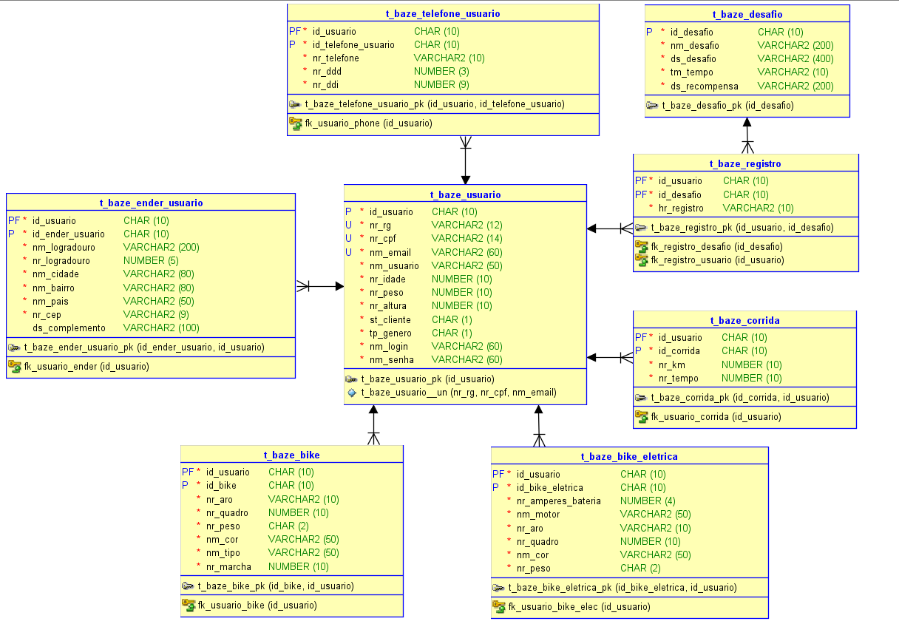
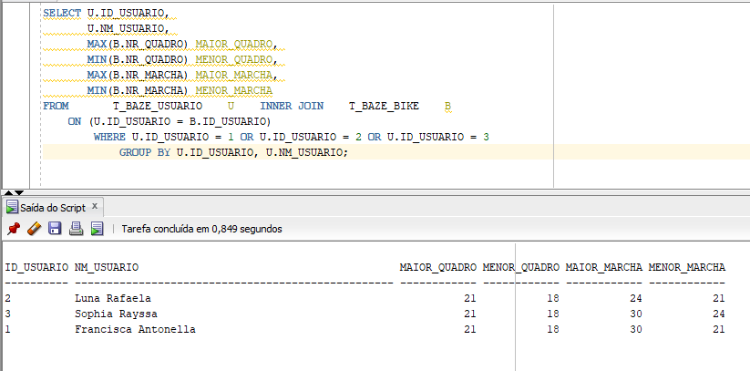
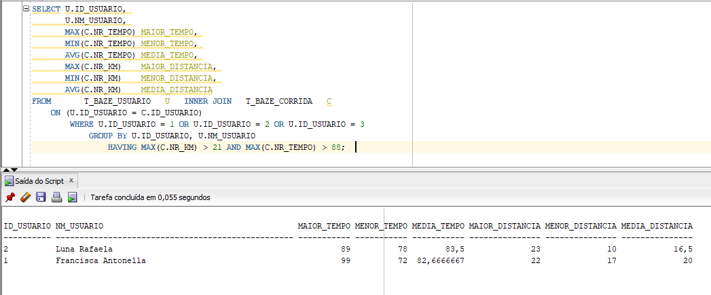

# Projeto BAZE

O projeto BAZE veio pelo desafio de mobilidade da FIAP, onde teríamos que desenvolver um MVP funcional que resolvesse algum problema de mobilidade atual. 
Como ideia inicial nós pensamos em desenvolver um aplicativo de GPS para ciclistas, que trouxesse rotas mais seguras e menos movimentadas.

Nesse repositório foi postado a minha parte do trabalho. Dividido em três partes, tenho aqui o DDL, DML e DQL do meu projeto.

# DDL (Criação de Tabelas)
Nosso projeto foi feito pensando em um modelo relacional. Este banco de dados possui 8 tabelas que se relacionam para formar um ambiente para usuário, bike, endereço e
etc...Todos os atributos de todas as tabelas foram comentados e dentro do arquivo DDL é possível observá-los.

# DML (Modelagem de dados)
Nosso desafio era usar 10 linhas para cada uma das tabelas do nosso banco, porém algumas das tabelas decidi expandir um pouco para observarmos de forma mais simplificada
nossos dados. Tudo que foi inserido precisava ser válido, por isso usamos alguns geradores de dados para facilitar nosso desenvolvimento.

# DQL (Querys)
Esta parte do desafio envolvia fazer 4 query's usando SQL. Decidimos fazer nossas maiores query's usando distância percorrida pelo usuário e para medir quais são os quadros e quantidade de marchas
de bike deste usuário (maior e menor). Nesta etapa do desafio precisavamos pensar em coisas que facilitariam o nosso desenvolvimento. 

Essas query's nos trouxeram ideias para nosso front-end (que mais para frente receberia formulários para guardar cada uma das bikes de cada um dos usuários).

# Resumo
Em resumo, as requisições da matéria de Banco de Dados para o nosso desafio da Global Solution foram estas. No total, tivemos cerca de 14 dias de trabalho e conseguimos
uma nota muito satisfatória (nota 9).
